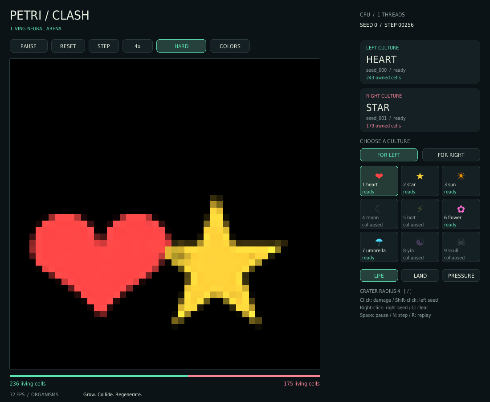

# Petri Clash · Living arena

Two independently trained neural cellular automata grow, collide, and regenerate. Watch the learned organisms, paint damage into the world, or inspect the territory and pressure underneath.



## Play on CPU, without retraining

From the repository root, using Python 3.11 or newer:

```bash
python -m venv .venv
source .venv/bin/activate  # Windows: .venv\Scripts\activate
python -m pip install torch --index-url https://download.pytorch.org/whl/cpu
python -m pip install -r v2/requirements.txt
python v2/clash.py --device cpu
```

Alternatively, the existing `v2/environment.yml` conda environment remains available. On Apple silicon, install the normal PyTorch wheel rather than the CPU-specific index; `--device auto` selects MPS when available. GPU paths are retained but this upgrade was verified on CPU only.

Start with heart versus star. The visual picker shows all nine targets and their exported evaluation status, and selects the best usable seed. Moon, bolt, yin, and skull have collapsed weights in the repository; they are visibly marked and rejected by default. Sun is usable but noticeably weaker than the other ready cultures. A `ready` label reflects saved evaluation metadata, not a new quality guarantee.

```bash
python v2/clash.py --list-models
python v2/clash.py --left 6 --right 7 --device cpu  # flower vs umbrella
python v2/soft_clash.py --device cpu              # free growth, no territory exclusion
```

There is no hidden bootstrap training or silent untrained fallback. Researchers can explicitly inspect failed or unverified weights using `--allow-unhealthy`, or request training with `--bootstrap-steps N`. An explicitly selected checkpoint seed must exist and pass the health filter unless overridden.

## The upgraded rules

Hard mode now lets neutral frontier cells retain their hidden developmental state while ownership accumulates. This fixes organisms that grew in training but immediately stalled or died under the previous ownership mask. Opponent-owned cells still suppress enemy hidden tissue; simultaneous proposals and sign-aware hysteresis keep captures symmetric. Abandoned land loses ownership, and nonfinite cells are quarantined.

Soft mode keeps both organisms independent. Switch modes with **M** or the mode button; changing mode resets the match. These are trained shape-growing organisms, not newly trained competitive agents. The rules improve growth and interaction without changing any weight files.

## Controls

| Action | Control |
|---|---|
| Pause / resume | Space or PAUSE |
| Advance one tick and pause | N or STEP |
| Replay the same seed | R or RESET |
| Cycle 1× / 2× / 4× / 8× speed | Tab or speed button |
| Toggle hard / soft rules and reset | M or mode button |
| Team colors | T or COLORS |
| Life / land / pressure view | Sidebar buttons |
| Select a culture | Click FOR LEFT / FOR RIGHT, then a tile |
| Select left / right with keyboard | 1–9 / Shift+1–9 |
| Damage crater | Left-click the arena |
| Plant a left / right seed | Shift+left-click / right-click |
| Change crater radius | [ / ] |
| Clear the arena | C |
| Exit | Esc |

The sidebar and title never receive grid clicks. Paused controls, repeated selection, damage, manual planting, and resizing are covered by CPU tests.

## Reproducible headless runs

```bash
python v2/clash.py --device cpu --seed 42 --headless-frames 256 \
  --report match.json --snapshot match.png
python v2/soft_clash.py --device cpu --headless-frames 256
```

`--headless-frames N` advances exactly N simulation ticks. It does not initialize SDL, create a window, render frames, or sleep to hit a frame rate. An optional snapshot renders only the final board via Pillow. `--report` records model sources, seed, rules, cell counts, territory, elapsed time, and device. `--snapshot` in interactive mode captures the complete window on exit. `--ui-frames N` bounds an interactive smoke run.

The same seed, model, settings, device, software versions, and action sequence replay the same match. Reset restores the simulation seed. Cross-device or cross-version bitwise equality is not promised. `--left-pos x,y` and `--right-pos x,y` override starting positions; use `--grid-size N` to change the arena size.

## CPU performance

The app defaults to one Torch CPU thread for these small convolutions; override with `--cpu-threads N` or `PETRI_CPU_THREADS=N`. More threads can be slower. Use a measured setting for your own machine:

```bash
python v2/benchmark.py --mode hard --steps 200 --warmup 20 --output benchmark.json
python v2/benchmark.py --mode hard --cpu-threads 4 --steps 200
python v2/benchmark.py --mode soft --steps 200
python v2/benchmark.py --mode nca --synthetic --steps 200  # explicit untrained microbenchmark
```

Benchmarks exclude warmup, loading, rendering, and frame pacing. Reports include p50/p95 latency, steps/second, versions, model fingerprints, and final-state hashes. See [verification](verification/README.md) for actual CPU results. No NCA math or parameter layout was changed for a speculative speedup.

## Training and checkpoint portability

```bash
cd v2
python train.py --target targets/01_heart.png --steps 3000 --device cpu
python -m trainer.eval_v2 --run-dir weights/01_heart/seed_000 --device cpu
```

Training is optional and may be slow on CPU. The [trainer guide](trainer/README.md) covers large runs. Evaluation now uses the saved architecture, data, and evaluation configuration, with explicit device overrides. Plain and `torch.compile` checkpoints work in play, evaluation, and resume. Existing exported weights are supported unchanged. New saves are atomic; resumable pool state keeps its original precision, so latest checkpoints can be larger than before.

Checkpoint loading uses PyTorch's restricted `weights_only` loader, with a narrow compatibility allowlist for historical NumPy RNG state. Only load checkpoints you trust. GPU execution and large training sweeps were not performed for this upgrade.

## Tests

From the repository root:

```bash
python -m pip install -r v2/requirements-dev.txt
PETRI_TEST_CHECKPOINTS=1 python -m pytest v2/tests -q
python -m compileall -q v2
```

The environment flag enables actual shipped-model growth checks; otherwise that slower check is skipped. CI runs the same CPU suite, plus headless and benchmark smoke runs. The workflow is included locally and has not run on GitHub until these changes are published.
