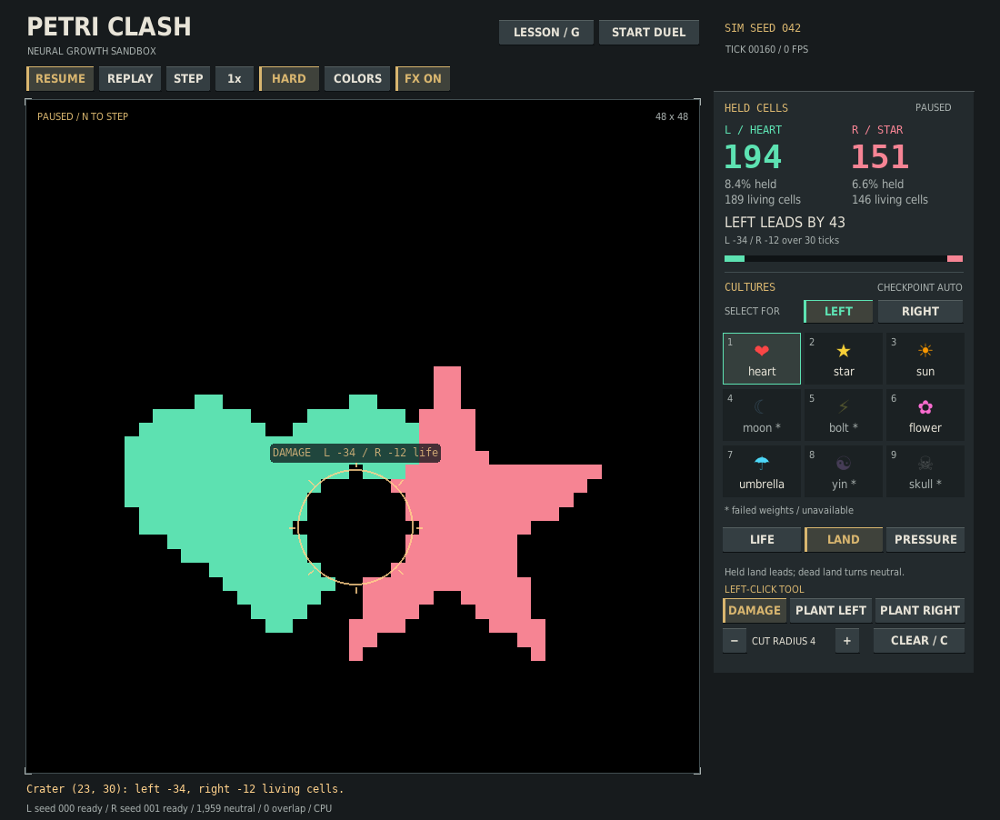
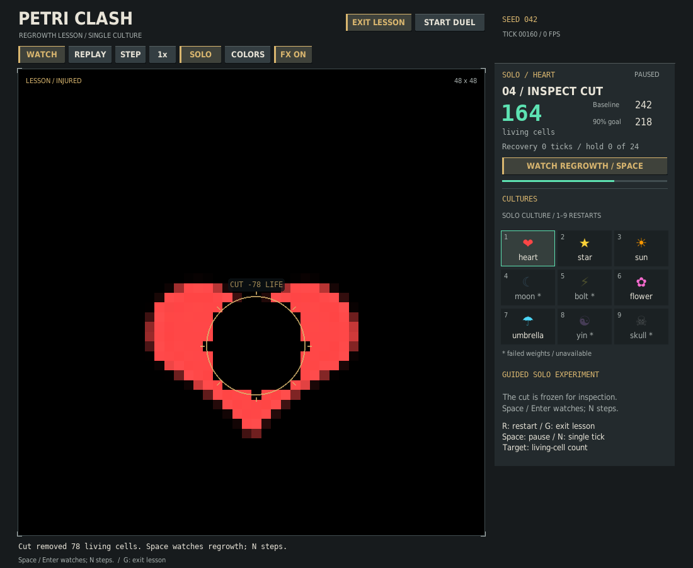

# Petri Clash · Living arena

Two independently trained neural cellular automata grow, collide, and regenerate. Watch the learned organisms, paint damage into the world, or inspect the territory and pressure underneath.



## Play on CPU, without retraining

From the repository root, using Python 3.11 or newer. On Apple silicon, replace
the CPU-index line below with `python -m pip install torch` (see the
[official installation guide](https://pytorch.org/get-started/locally/)):

```bash
python -m venv .venv
source .venv/bin/activate  # Windows: .venv\Scripts\activate
python -m pip install torch --index-url https://download.pytorch.org/whl/cpu
python -m pip install -r v2/requirements.txt
python v2/clash.py --device cpu
```

Alternatively, the existing `v2/environment.yml` conda environment remains available. `--device auto` selects MPS on Apple silicon when available. GPU paths are retained but this upgrade was verified on CPU only.

Start with heart versus star. By default, the visual picker shows all nine targets and their exported evaluation status, and selects the best usable seed. Moon, bolt, yin, and skull have collapsed weights in the repository; they are visibly marked and rejected by default. Sun is usable but noticeably weaker than the other ready cultures. A `ready` label reflects saved evaluation metadata, not a new quality guarantee.

```bash
python v2/clash.py --list-models
python v2/clash.py --left 6 --right 7 --device cpu  # flower vs umbrella
python v2/soft_clash.py --device cpu              # free growth, no territory exclusion
```

There is no hidden bootstrap training or silent untrained fallback. Researchers can explicitly inspect failed or unverified weights using `--allow-unhealthy`, or request training with `--bootstrap-steps N`. An explicitly selected checkpoint seed must exist and pass the health filter unless overridden.

`--left-seed N` and `--right-seed N` pin checkpoint selection for each side. The picker shows **CHECKPOINT AUTO** or **CHECKPOINT PIN N** for the selected side, and its tiles reflect that exact selection policy. Pins remain in place when choosing another culture. `--list-models` lists automatic choices without these side-specific pins. The separate **SIM SEED** label controls stochastic match replay; it is not a checkpoint identifier.

The line below the field identifies the actual loaded left/right checkpoint seeds and their health. Research overrides keep failed/unverified models visibly labeled; allowing a model does not make it ready. If leaving a lesson needs a temporary opponent fallback, the notice identifies what was actually loaded and preserves the original right-side pin for subsequent choices. See the [checkpoint-picker verification](verification/checkpoint-picker.md).

## Interface direction

The field takes priority: a larger square board sits beside a compact instrument rail, with a fixed 16px gap, squared controls, warm amber actions, and mint/rose team information. Bold headings and tabular scores establish a clear hierarchy; explanatory text stays normal-weight. The composition was informed by the [Into the Breach publisher screenshots](https://store.steampowered.com/app/590380/Into_the_Breach/) and the designer's [GDC postmortem on readability and single-screen play](https://media.gdcvault.com/gdc2019/presentations/Into%20the%20Breach%20Postmortem%20Final.pdf). The drawing code is original Pygame and uses the repository's own target images, with system-font fallbacks.

## Read the battle at a glance

In the default sandbox, the live scoreboard counts **held cells in hard mode** and **living cells in soft mode**. Large exact counters, a lead margin, full-board percentages, and recent net changes make the comparison explicit. Hard-mode grey in the bar is neutral land; the two soft-mode bars independently show each culture’s fraction of the board (which may overlap). A sandbox lead is not a declared winner; use a seeded duel for a scored round.

Short, time-based visual easing smooths the board without changing cell ownership, model state, the RNG, or simulation ticks. Land and pressure share the left-green/right-coral palette. Changing views, replaying, or editing snaps to the correct new board instead of blending unrelated states.

Damage creates a crater pulse and reports the exact number of living cells erased on each side. Planting creates a side-colored seed marker, and the action result remains below the board. Effects use wall time and finish even while paused; scores update immediately. Use **F / FX ON-OFF** or `--reduced-motion` to disable easing and moving effects. Recent score deltas are observed net changes, not guessed kill/capture attribution, and cover the displayed number of simulation ticks.

## Edit the lab with the mouse

The sandbox's **LEFT-CLICK TOOL** row has **DAMAGE**, **PLANT LEFT** and
**PLANT RIGHT**. Choose a tool, then click the field. **− / +** change the damage
radius, and **CLEAR / C** empties the field. Planting always places one seed;
the cut radius does not make it larger. Pause first if you want to inspect each
edit before growth resumes.

The pointer shows the actual cell and tool: a crater circle for damage, or a
crosshair marked **L / R** for planting. Text and static markers remain with
**FX OFF**. **Shift-click** temporarily plants left and **right-click** temporarily
plants right without changing the selected tool. Damage is selected on startup.
After switching back from another window, release and press Shift again before
using that shortcut; the visible tools do not require a modifier key.

Tool selection is independent of **FOR LEFT / FOR RIGHT**, which selects the
culture slot to replace. Switching tools does not load models, change checkpoint
pins or advance the simulation. Clear and replay keep your tool; returning from
a lesson or duel starts a fresh lab with damage selected. Lab edits remain
locked in lessons and scored duels. See the [lab controls verification](verification/lab-tools.md).

## Try the regrowth lesson

Press **G / LESSON** or launch `python v2/clash.py --device cpu --lesson` for an optional guided experiment:

1. Plant at the marked crosshair with **Shift-click or Enter**.
2. Watch one culture grow for exactly 160 ticks. **Space** pauses and **N** steps.
3. Inspect a highlighted cut selected to remove 25–60% of its living cells. **Click the cut or Enter** to apply it once.
4. The injured field pauses. **Space / Enter** starts slow observation; **N** inspects one tick.
5. The experiment stops when living-cell count stays at or above 90% of its pre-cut count for 24 ticks, or after 160 recovery ticks.



Recovery plays at six simulation ticks per second at 1× while the interface keeps rendering at the configured frame rate. Speed changes multiply that observation rate; they do not alter the count goal or RNG. The final panel retains the before/cut/current counts and tick-based result. This measures living-cell count, not exact shape or color restoration.

The lesson uses a fresh 48×48 solo soft-growth field. No invisible opponent is stepped. Safe practice cuts remove all state channels in the marked disk; if no suitable cut exists, the lesson says so without applying one. Free editing and rule changes stay locked while it is active. **R** or culture selection restarts, **G / EXIT LESSON** returns to a fresh lab with its previous grid/rules/speed, and **D / START DUEL** begins a fresh duel. The sandbox and duels still start normally unless the lesson is explicitly chosen.

The lesson is interactive, so `--lesson` cannot be combined with `--duel` or `--headless-frames`. An active lesson's snapshot is included in the normal `--report` output on exit. Keyboard equivalents, persistent instructions and static preview cues work with reduced motion; native screen-reader support is not claimed. See the [lesson verification and design references](verification/lesson.md).

Direct `--lesson` startup loads only its selected culture. When returning to two-culture play, the requested opponent is loaded then. If that checkpoint is unavailable, a visible notice identifies the current loaded culture used on both sides. The original right-side checkpoint pin is kept, so subsequent right-side choices still honor it.

## Seeded duels

Press **D / START DUEL** for a complete round, or launch with `--duel`. The default round runs for **600 simulation ticks**: 60 ticks of unscored growth, then 540 scoring ticks. Every scoring tick adds each side's held cells in hard mode, or living cells in soft mode. The higher integer total wins; an exact tie is a draw. The HUD shows the average across scored ticks, current cells, and ticks remaining. The result also shows the exact **cell-tick** totals: scoring rewards sustained growth rather than only the final board.

- Pausing stops the round clock. Speed changes only how quickly those same ticks play; they do not change the scoring window.
- Default starts are mirrored horizontally with equal border distances. Explicit `--left-pos` / `--right-pos` overrides are allowed and reported as custom placement.
- Planting, damage, and clearing are locked during a duel, including after it ends. Return to **LAB** to edit freely. Changing culture or hard/soft rules begins a fresh round.
- A completed round freezes its simulation and score. **R / Enter / REMATCH** repeats the same seed; **NEXT SEED** advances the seed for another round. **D / BACK TO LAB** starts a fresh sandbox.
- **HIDE / RESULT** closes and reopens the result panel, so you can inspect the frozen board in any view without losing the outcome.
- Soft duels compare independent growth; they do not capture territory, and living cells can overlap. These are shape-growing cultures with different sizes and strengths, not balanced competitive agents. A duel win is an arena outcome, not a model-quality ranking.
- Non-finite state invalidates the round without awarding a winner.

```bash
python v2/clash.py --device cpu --duel --seed 42
python v2/clash.py --device cpu --duel --round-ticks 300 --warmup-ticks 30 \
  --headless-frames 300 --report duel.json --snapshot duel.png
```

The sandbox remains the default. Custom rounds require `0 <= warmup-ticks < round-ticks`. Headless requests shorter than the round produce an in-progress score; larger requests stop at the round's exact endpoint. The report includes phase, scored ticks, integer totals, averages, winner, and placement type.

See the [duel verification report](verification/duels.md) for screenshots, regression coverage, and measured CPU cost.

This addition applies the explicit-objective and readable-outcome direction of [Subset's Into the Breach](https://www.subsetgames.com/itb.html), with a one-action start/rematch following the [Game Accessibility Guidelines' quick-start recommendation](https://gameaccessibilityguidelines.com/allow-the-game-to-be-started-without-the-need-to-navigate-through-multiple-levels-of-menus/). The cellular simulation remains Petri Clash's own; it does not imitate turn-based combat or promise perfect information.

## Save and rerun a duel

After a valid CPU duel finishes, press **S / SAVE DUEL** to keep its portable recipe before moving to the next round. Files go in `./duels/` by default; `--duel-save-dir DIR` chooses another folder. Repeated saves of the same result reuse its existing file, and new rounds get separate files without overwriting earlier saves. Saving does not advance the simulation or consume its RNG. The shortcut also works while the result panel is hidden.

For a scripted run, `--export-duel FILE` writes a recipe for the final completed round on exit. It uses the cultures, checkpoint seeds, rules and positions actually played, including changes made in the interface:

```bash
python v2/clash.py --device cpu --duel --seed 42 --headless-frames 600 \
  --export-duel saved-duel.json
python v2/replay.py saved-duel.json --report replay-check.json --snapshot replay-board.png
```

The replay command reruns the full round headlessly on CPU and reports **Saved scores matched** or **Saved scores differed**, with both exact integer totals. It accepts output controls, not new model/rule settings. Missing or unhealthy exact checkpoint selections are rejected without substituting weights or training. Exit status is 0 for matching scores, 1 for different scores or an invalid simulation, and 2 for input/loading/output errors.

Recipes contain portable culture identifiers, checkpoint seed numbers, simulation settings, runtime versions and expected scores. They exclude local checkpoint paths, weights, tensors and RNG states. Ordinary `--report` files remain diagnostic reports and are not recipe files. Export requires a valid, finished, finite CPU duel using ready checkpoints; it rejects partial rounds, lessons and the sandbox. The bounded format supports grids from 8 through 128, at most 10,000 total ticks, and 1–64 CPU threads.

Runtime differences produce a warning before the score check. Matching scores alone do not verify identical tensor history, model identity or provenance; changed weights under the same culture/seed cannot be detected from the recipe. See the [recipe format and verification](verification/duel-recipes.md) for validation rules and reproducibility limits. Explicit export/report destinations replace their files; recipe replacement is atomic. Output files must be distinct, and replay outputs cannot overwrite the input recipe.

## Compare both sides

One round can depend on which side a culture starts on. The compact comparison command plays each seed twice, swaps the cultures, and adds each culture's exact cell-tick scores across both legs:

```bash
python v2/compare.py --left 1 --right 6 --seeds 0,7,42 --report comparison.json
```

Here **A** is heart and **B** is flower in both orientations. The default is six CPU rounds; `--mode soft`, `--round-ticks`, `--warmup-ticks`, and explicit checkpoint seeds are supported. No training or window is started. The terminal identifies the selected cultures and checkpoint seeds; the optional JSON retains every leg, configuration, paired totals, and side-swap outcome changes without host paths.

These are small seeded comparisons, not calibrated rankings. In the measured heart/flower example, seed 7 changes winning culture after the swap; combining both legs favors flower. Failed or invalid rounds stop the comparison without assigning an overall winner. See the [comparison guide and verification](verification/compare.md).

## The upgraded rules

Hard mode now lets neutral frontier cells retain their hidden developmental state while ownership accumulates. This fixes organisms that grew in training but immediately stalled or died under the previous ownership mask. Opponent-owned cells still suppress enemy hidden tissue; simultaneous proposals and sign-aware hysteresis keep captures symmetric. Abandoned land loses ownership, and nonfinite cells are quarantined.

Soft mode keeps both organisms independent. Switch modes with **M** or the mode button; changing mode resets the match. These are trained shape-growing organisms, not newly trained competitive agents. The rules improve growth and interaction without changing any weight files.

## Controls

| Action | Control |
|---|---|
| Pause / resume | Space or PAUSE |
| Advance one tick and pause | N or STEP |
| Replay the same seed | R or RESET |
| Start a duel / return to sandbox | D or START DUEL / BACK TO LAB |
| Start / exit the regrowth lesson | G or LESSON / EXIT LESSON |
| Apply the lesson's current action | Enter or the highlighted lesson button |
| Rematch a completed duel | Enter, R or REMATCH |
| Play a completed duel with the next seed | NEXT SEED |
| Save a completed CPU duel recipe | S or SAVE DUEL |
| Cycle 1× / 2× / 4× / 8× speed | Tab or speed button |
| Toggle hard / soft rules and reset | M or mode button |
| Team colors | T or COLORS |
| Reduce motion | F or FX ON-OFF |
| Life / land / pressure view | Sidebar buttons |
| Select a culture | Click FOR LEFT / FOR RIGHT, then a tile |
| Select left / right with keyboard | 1–9 / Shift+1–9 |
| Damage crater | DAMAGE, then left-click the arena (default tool) |
| Plant a left / right seed | PLANT LEFT / PLANT RIGHT, then left-click; or Shift+left-click / right-click |
| Change crater radius | − / + or [ / ] |
| Clear the arena | CLEAR / C or C |
| Exit | Esc |

The sidebar and title never receive grid clicks. Paused controls, repeated selection, damage, manual planting, and resizing are covered by CPU tests.

## Reproducible headless runs

```bash
python v2/clash.py --device cpu --seed 42 --headless-frames 256 \
  --report match.json --snapshot match.png
python v2/soft_clash.py --device cpu --headless-frames 256
```

`--headless-frames N` advances exactly N simulation ticks in the sandbox, or up to the duel's endpoint when `--duel` is enabled. It does not initialize SDL, create a window, render frames, or sleep to hit a frame rate. An optional snapshot renders only the final board via Pillow. `--report` records model sources, seed, rules, cell counts, territory, elapsed time, device, and duel status. `--snapshot` in interactive mode captures the complete window on exit, freshly rendered from the final state rather than an older interpolated frame. `--ui-frames N` bounds an interactive smoke run.

Ordinary match and benchmark reports contain local checkpoint paths; benchmarks also contain checkpoint and final-state fingerprints. Review and sanitize them before sharing. Portable comparison, recipe and replay-check reports omit those paths and fingerprints.

The same seed, model, settings, device, software versions, and action sequence replay the same match. Reset restores the simulation seed. Cross-device or cross-version bitwise equality is not promised. `--left-pos x,y` and `--right-pos x,y` override starting positions; use `--grid-size N` to change the arena size.

## CPU performance

The app defaults to one Torch CPU thread for these small convolutions; override with `--cpu-threads N` or `PETRI_CPU_THREADS=N`. More threads can be slower. Use a measured setting for your own machine:

```bash
python v2/benchmark.py --mode hard --steps 200 --warmup 20 --output benchmark.json
python v2/benchmark.py --mode hard --cpu-threads 4 --steps 200
python v2/benchmark.py --mode soft --steps 200
python v2/benchmark.py --mode nca --synthetic --steps 200  # explicit untrained microbenchmark
```

Benchmarks exclude warmup, loading, rendering, and frame pacing. Reports include p50/p95 latency, steps/second, versions, model fingerprints, and final-state hashes. See [verification](verification/README.md) for actual CPU results. No NCA math or parameter layout was changed for a speculative speedup.

The UI also avoids empty full-board effect overlays and prepares the fixed-size culture previews once. The [raster-efficiency report](verification/raster-efficiency.md) measures that drawing improvement and verifies identical pixels, simulation tensors and RNG state; it does not claim a simulation or native-display speedup.

Ordinary CPU inference now reuses the first convolution's temporary activation for ReLU. With the shipped heart/star and heart/flower models, this reduced median simulation-tick latency by **24–32%** in the measured one-thread runs; four complete seeded duels retained bitwise-identical state and RNG at every tick. Training, accelerator, `torch.compile`, custom-layer and activation-hook paths retain the original allocation behavior. See the [inference-efficiency report and reproducible benchmark](verification/inference-efficiency.md) for timings, safeguards and limits; hardware-dependent simulation gains are not a universal FPS guarantee.

Paused fields now reuse one scaled image only while its final pixels and size stay identical. This reduced warm, settled paused-lab drawing time by about **10–16%** in measured SDL runs; live frames retain the original rendering path. Editing, easing, effects and resize behavior remain pixel-exact. See the [frozen-board rendering and Python 3.13 verification](verification/frozen-board-rendering.md).

## Training and checkpoint portability

```bash
cd v2
python train.py --target targets/01_heart.png --steps 3000 --device cpu \
  --no-compile --no-amp --export-root user-weights
python -m trainer.eval_v2 --run-dir user-weights/01_heart/seed_000 --device cpu
```

Training is optional and may be slow on CPU. The example exports to `v2/user-weights/`, keeping the bundled playable weights intact. Omitting `--export-root` uses `weights` and replaces the matching culture/seed export, which can change gameplay and saved-recipe results. The arena still selects from bundled `weights`; an experiment in `user-weights` is not automatically activated.

The [trainer guide](trainer/README.md) covers large runs. Evaluation now uses the saved architecture, data, and evaluation configuration, with explicit device overrides. Plain and `torch.compile` checkpoints work in play, evaluation, and resume. Existing exported weights are supported unchanged. Trainer checkpoint writes are atomic; the separate export-copy operation is not transactional. Resumable pool state keeps its original precision, so latest checkpoints can be larger than before.

Checkpoint loading uses PyTorch's restricted `weights_only` loader, with a narrow compatibility allowlist for historical NumPy RNG state. Malformed play metadata and expected restricted-loader failures produce a recoverable selection error, retaining the current match. See the [reliability checks](verification/reliability.md). Only load checkpoints you trust. GPU execution and large training sweeps were not performed for this upgrade.

See the [feedback verification report](verification/feedback.md) for UI coverage, reproducible screenshots and measured presentation overhead.

## Tests

From the repository root:

```bash
python -m pip install -r v2/requirements-dev.txt
PETRI_TEST_CHECKPOINTS=1 python -m pytest v2/tests -q
python -m compileall -q v2
```

The environment flag enables actual shipped-model growth checks; otherwise that slower check is skipped. CI runs the same CPU suite, plus headless and benchmark smoke runs. The workflow runs on both pull requests and pushes; see the pull request for the exact revision’s CI status.

The declared runtime minimums were also installed and tested together on Python 3.11, alongside current-package Python 3.12 and 3.13 environments. See the [dependency-floor verification](verification/minimum-dependencies.md) for exact versions and platform limits.
