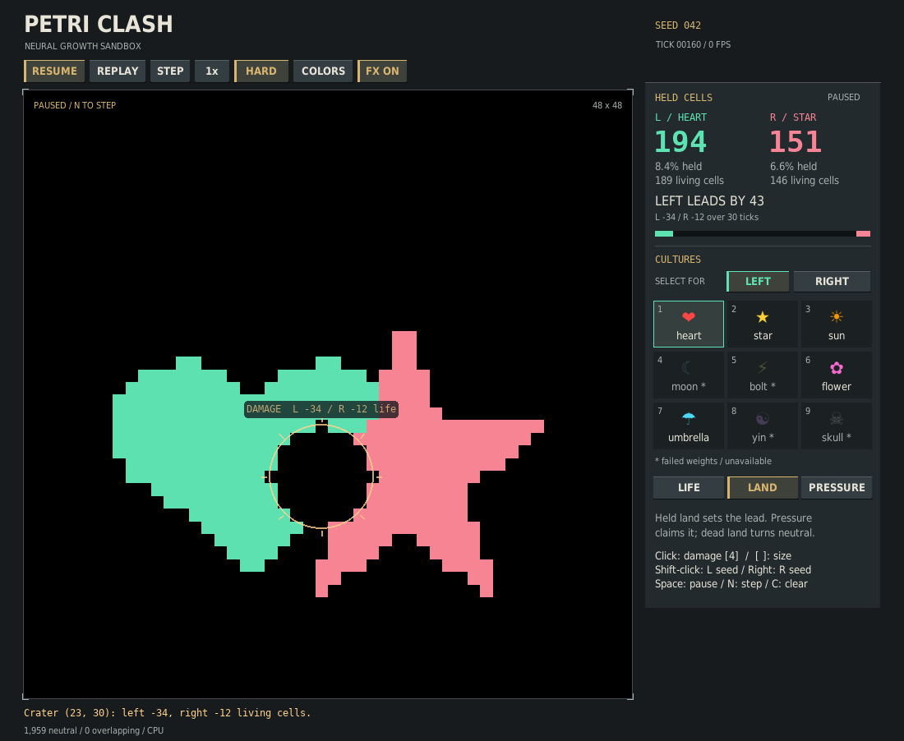

# Petri Clash · Living arena

Two independently trained neural cellular automata grow, collide, and regenerate. Watch the learned organisms, paint damage into the world, or inspect the territory and pressure underneath.



## Play on CPU, without retraining

From the repository root, using Python 3.11 or newer:

```bash
python -m venv .venv
source .venv/bin/activate  # Windows: .venv\Scripts\activate
python -m pip install torch --index-url https://download.pytorch.org/whl/cpu
python -m pip install -r v2/requirements.txt
python v2/clash.py --device cpu
```

Alternatively, the existing `v2/environment.yml` conda environment remains available. On Apple silicon, install the normal PyTorch wheel rather than the CPU-specific index; `--device auto` selects MPS when available. GPU paths are retained but this upgrade was verified on CPU only.

Start with heart versus star. The visual picker shows all nine targets and their exported evaluation status, and selects the best usable seed. Moon, bolt, yin, and skull have collapsed weights in the repository; they are visibly marked and rejected by default. Sun is usable but noticeably weaker than the other ready cultures. A `ready` label reflects saved evaluation metadata, not a new quality guarantee.

```bash
python v2/clash.py --list-models
python v2/clash.py --left 6 --right 7 --device cpu  # flower vs umbrella
python v2/soft_clash.py --device cpu              # free growth, no territory exclusion
```

There is no hidden bootstrap training or silent untrained fallback. Researchers can explicitly inspect failed or unverified weights using `--allow-unhealthy`, or request training with `--bootstrap-steps N`. An explicitly selected checkpoint seed must exist and pass the health filter unless overridden.

## Interface direction

The field takes priority: a larger square board sits beside a compact instrument rail, with a fixed 16px gap, squared controls, warm amber actions, and mint/rose team information. Bold headings and tabular scores establish a clear hierarchy; explanatory text stays normal-weight. The composition was informed by the [Into the Breach publisher screenshots](https://store.steampowered.com/app/590380/Into_the_Breach/) and the designer's [GDC postmortem on readability and single-screen play](https://media.gdcvault.com/gdc2019/presentations/Into%20the%20Breach%20Postmortem%20Final.pdf). The drawing code is original Pygame and uses the repository's own target images, with system-font fallbacks.

## Read the battle at a glance

In the default sandbox, the live scoreboard counts **held cells in hard mode** and **living cells in soft mode**. Large exact counters, a lead margin, full-board percentages, and recent net changes make the comparison explicit. Hard-mode grey in the bar is neutral land; the two soft-mode bars independently show each culture’s fraction of the board (which may overlap). A sandbox lead is not a declared winner; use a seeded duel for a scored round.

Short, time-based visual easing smooths the board without changing cell ownership, model state, the RNG, or simulation ticks. Land and pressure share the left-green/right-coral palette. Changing views, replaying, or editing snaps to the correct new board instead of blending unrelated states.

Damage creates a crater pulse and reports the exact number of living cells erased on each side. Planting creates a side-colored seed marker, and the action result remains below the board. Effects use wall time and finish even while paused; scores update immediately. Use **F / FX ON-OFF** or `--reduced-motion` to disable easing and moving effects. Recent score deltas are observed net changes, not guessed kill/capture attribution, and cover the displayed number of simulation ticks.

## Seeded duels

Press **D / START DUEL** for a complete round, or launch with `--duel`. The default round runs for **600 simulation ticks**: 60 ticks of unscored growth, then 540 scoring ticks. Every scoring tick adds each side's held cells in hard mode, or living cells in soft mode. The higher integer total wins; an exact tie is a draw. The HUD shows the average across scored ticks, current cells, and ticks remaining. The result also shows the exact **cell-tick** totals: scoring rewards sustained growth rather than only the final board.

- Pausing stops the round clock. Speed changes only how quickly those same ticks play; they do not change the scoring window.
- Default starts are mirrored horizontally with equal border distances. Explicit `--left-pos` / `--right-pos` overrides are allowed and reported as custom placement.
- Planting, damage, and clearing are locked during a duel, including after it ends. Return to **LAB** to edit freely. Changing culture or hard/soft rules begins a fresh round.
- A completed round freezes its simulation and score. **R / Enter / REMATCH** repeats the same seed; **NEXT SEED** advances the seed for another round. **D / BACK TO LAB** starts a fresh sandbox.
- **HIDE / RESULT** closes and reopens the result panel, so you can inspect the frozen board in any view without losing the outcome.
- Soft duels compare independent growth; they do not capture territory, and living cells can overlap. These are shape-growing cultures with different sizes and strengths, not balanced competitive agents. A duel win is an arena outcome, not a model-quality ranking.
- Non-finite state invalidates the round without awarding a winner.

```bash
python v2/clash.py --device cpu --duel --seed 42
python v2/clash.py --device cpu --duel --round-ticks 300 --warmup-ticks 30 \
  --headless-frames 300 --report duel.json --snapshot duel.png
```

The sandbox remains the default. Custom rounds require `0 <= warmup-ticks < round-ticks`. Headless requests shorter than the round produce an in-progress score; larger requests stop at the round's exact endpoint. The report includes phase, scored ticks, integer totals, averages, winner, and placement type.

See the [duel verification report](verification/duels.md) for screenshots, regression coverage, and measured CPU cost.

This addition applies the explicit-objective and readable-outcome direction of [Subset's Into the Breach](https://www.subsetgames.com/itb.html), with a one-action start/rematch following the [Game Accessibility Guidelines' quick-start recommendation](https://gameaccessibilityguidelines.com/allow-the-game-to-be-started-without-the-need-to-navigate-through-multiple-levels-of-menus/). The cellular simulation remains Petri Clash's own; it does not imitate turn-based combat or promise perfect information.

## Compare both sides

One round can depend on which side a culture starts on. The compact comparison command plays each seed twice, swaps the cultures, and adds each culture's exact cell-tick scores across both legs:

```bash
python v2/compare.py --left 1 --right 6 --seeds 0,7,42 --report comparison.json
```

Here **A** is heart and **B** is flower in both orientations. The default is six CPU rounds; `--mode soft`, `--round-ticks`, `--warmup-ticks`, and explicit checkpoint seeds are supported. No training or window is started. The terminal identifies the selected cultures and checkpoint seeds; the optional JSON retains every leg, configuration, paired totals, and side-swap outcome changes without host paths.

These are small seeded comparisons, not calibrated rankings. In the measured heart/flower example, seed 7 changes winning culture after the swap; combining both legs favors flower. Failed or invalid rounds stop the comparison without assigning an overall winner. See the [comparison guide and verification](verification/compare.md).

## The upgraded rules

Hard mode now lets neutral frontier cells retain their hidden developmental state while ownership accumulates. This fixes organisms that grew in training but immediately stalled or died under the previous ownership mask. Opponent-owned cells still suppress enemy hidden tissue; simultaneous proposals and sign-aware hysteresis keep captures symmetric. Abandoned land loses ownership, and nonfinite cells are quarantined.

Soft mode keeps both organisms independent. Switch modes with **M** or the mode button; changing mode resets the match. These are trained shape-growing organisms, not newly trained competitive agents. The rules improve growth and interaction without changing any weight files.

## Controls

| Action | Control |
|---|---|
| Pause / resume | Space or PAUSE |
| Advance one tick and pause | N or STEP |
| Replay the same seed | R or RESET |
| Start a duel / return to sandbox | D or START DUEL / BACK TO LAB |
| Rematch a completed duel | Enter, R or REMATCH |
| Play a completed duel with the next seed | NEXT SEED |
| Cycle 1× / 2× / 4× / 8× speed | Tab or speed button |
| Toggle hard / soft rules and reset | M or mode button |
| Team colors | T or COLORS |
| Reduce motion | F or FX ON-OFF |
| Life / land / pressure view | Sidebar buttons |
| Select a culture | Click FOR LEFT / FOR RIGHT, then a tile |
| Select left / right with keyboard | 1–9 / Shift+1–9 |
| Damage crater | Left-click the arena |
| Plant a left / right seed | Shift+left-click / right-click |
| Change crater radius | [ / ] |
| Clear the arena | C |
| Exit | Esc |

The sidebar and title never receive grid clicks. Paused controls, repeated selection, damage, manual planting, and resizing are covered by CPU tests.

## Reproducible headless runs

```bash
python v2/clash.py --device cpu --seed 42 --headless-frames 256 \
  --report match.json --snapshot match.png
python v2/soft_clash.py --device cpu --headless-frames 256
```

`--headless-frames N` advances exactly N simulation ticks in the sandbox, or up to the duel's endpoint when `--duel` is enabled. It does not initialize SDL, create a window, render frames, or sleep to hit a frame rate. An optional snapshot renders only the final board via Pillow. `--report` records model sources, seed, rules, cell counts, territory, elapsed time, device, and duel status. `--snapshot` in interactive mode captures the complete window on exit. `--ui-frames N` bounds an interactive smoke run.

The same seed, model, settings, device, software versions, and action sequence replay the same match. Reset restores the simulation seed. Cross-device or cross-version bitwise equality is not promised. `--left-pos x,y` and `--right-pos x,y` override starting positions; use `--grid-size N` to change the arena size.

## CPU performance

The app defaults to one Torch CPU thread for these small convolutions; override with `--cpu-threads N` or `PETRI_CPU_THREADS=N`. More threads can be slower. Use a measured setting for your own machine:

```bash
python v2/benchmark.py --mode hard --steps 200 --warmup 20 --output benchmark.json
python v2/benchmark.py --mode hard --cpu-threads 4 --steps 200
python v2/benchmark.py --mode soft --steps 200
python v2/benchmark.py --mode nca --synthetic --steps 200  # explicit untrained microbenchmark
```

Benchmarks exclude warmup, loading, rendering, and frame pacing. Reports include p50/p95 latency, steps/second, versions, model fingerprints, and final-state hashes. See [verification](verification/README.md) for actual CPU results. No NCA math or parameter layout was changed for a speculative speedup.

The UI also avoids empty full-board effect overlays and prepares the fixed-size culture previews once. The [raster-efficiency report](verification/raster-efficiency.md) measures that drawing improvement and verifies identical pixels, simulation tensors and RNG state; it does not claim a simulation or native-display speedup.

## Training and checkpoint portability

```bash
cd v2
python train.py --target targets/01_heart.png --steps 3000 --device cpu
python -m trainer.eval_v2 --run-dir weights/01_heart/seed_000 --device cpu
```

Training is optional and may be slow on CPU. The [trainer guide](trainer/README.md) covers large runs. Evaluation now uses the saved architecture, data, and evaluation configuration, with explicit device overrides. Plain and `torch.compile` checkpoints work in play, evaluation, and resume. Existing exported weights are supported unchanged. New saves are atomic; resumable pool state keeps its original precision, so latest checkpoints can be larger than before.

Checkpoint loading uses PyTorch's restricted `weights_only` loader, with a narrow compatibility allowlist for historical NumPy RNG state. Only load checkpoints you trust. GPU execution and large training sweeps were not performed for this upgrade.

See the [feedback verification report](verification/feedback.md) for UI coverage, reproducible screenshots and measured presentation overhead.

## Tests

From the repository root:

```bash
python -m pip install -r v2/requirements-dev.txt
PETRI_TEST_CHECKPOINTS=1 python -m pytest v2/tests -q
python -m compileall -q v2
```

The environment flag enables actual shipped-model growth checks; otherwise that slower check is skipped. CI runs the same CPU suite, plus headless and benchmark smoke runs. The workflow runs on both pull requests and pushes; see the pull request for the exact revision’s CI status.
