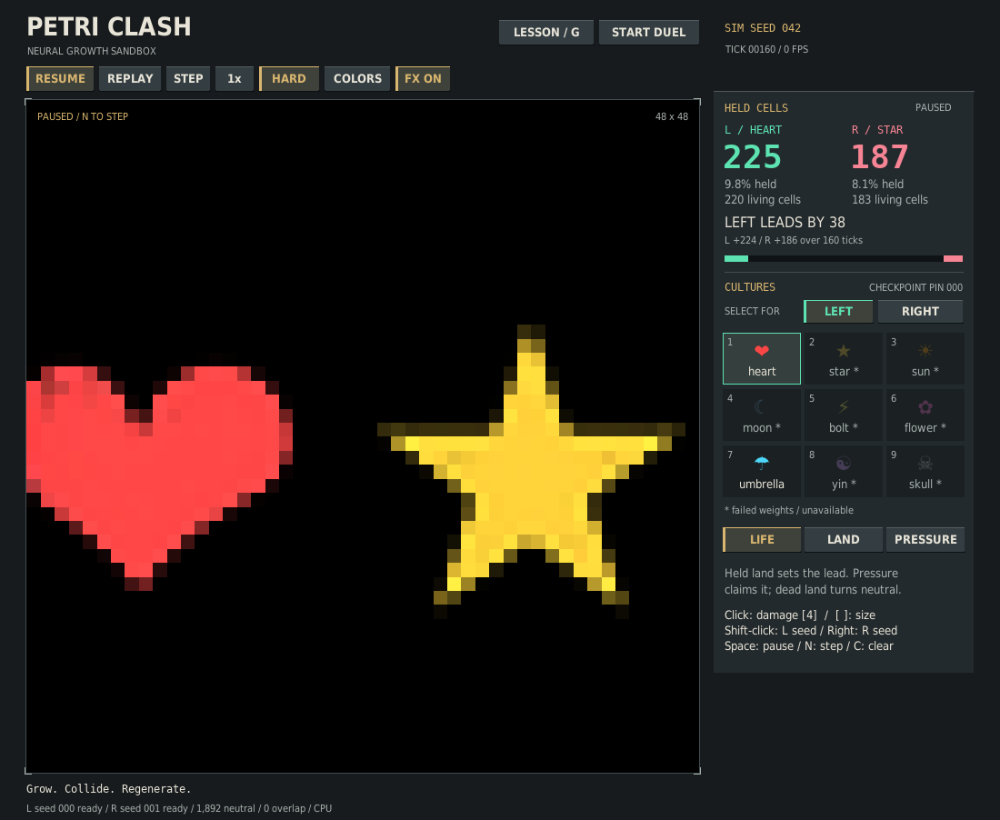
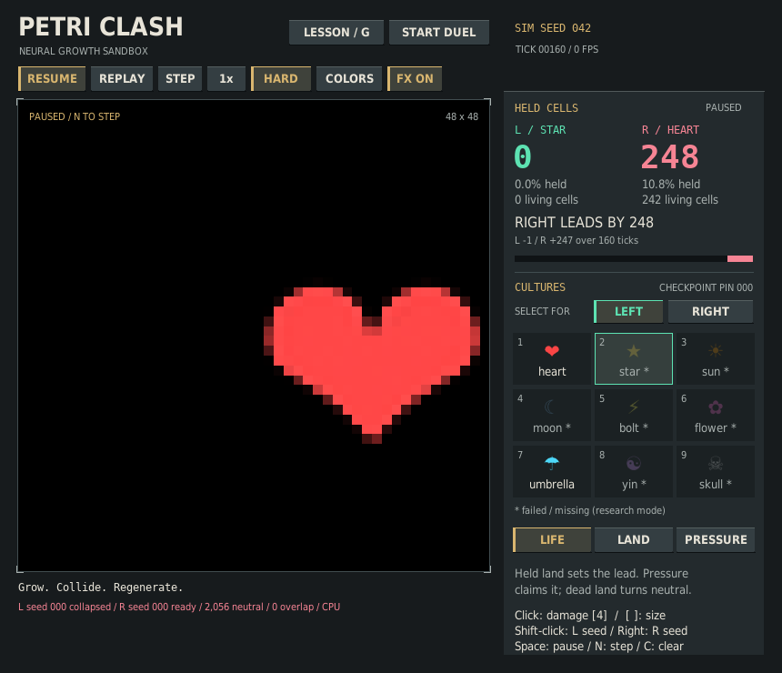
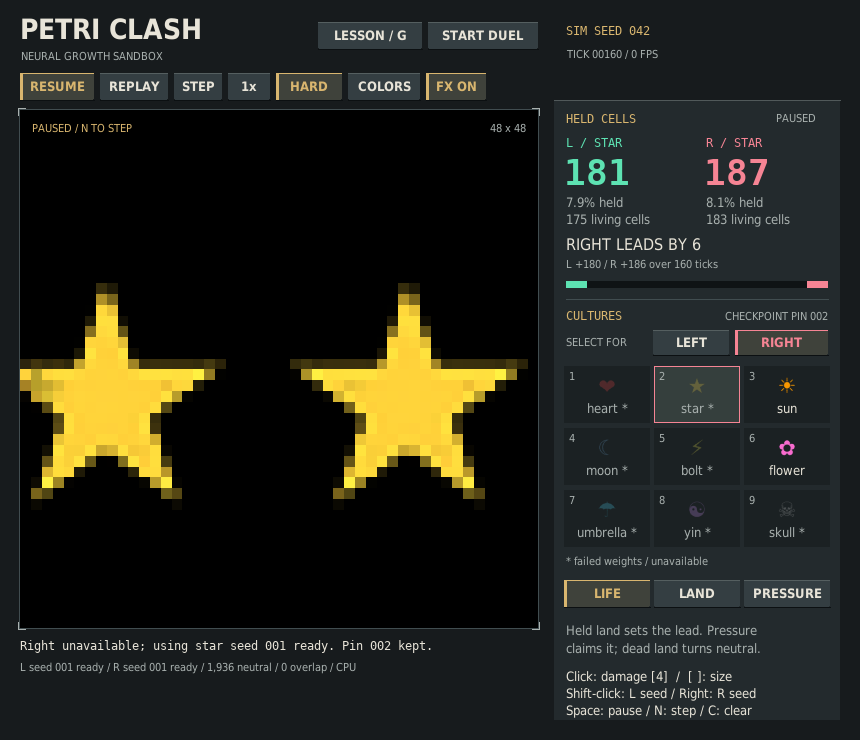

# Checkpoint picker consistency

Verified on 2026-10-04 against the cumulative recipe revision
`c4123c1e24cf62b2237830a3738224722e40cc13`. This corrects selection metadata and
fallback intent; model weights, NCA math, battle rules, scoring and `v1/` are
unchanged.

## Confirmed problems

The loader honored `--left-seed` and `--right-seed`, but picker tiles described
the best checkpoint across all seeds. A pinned selection could therefore look
ready and then fail with a contradictory `(ready)` diagnostic.

Actual shipped metadata now produces these consistent results:

| Target and policy | Candidate seed | Health | Selectable |
|---|---:|---|---|
| Star, automatic | 1 | ready | yes |
| Star, pin 0 | 0 | collapsed | no |
| Star, pin 0, research override | 0 | collapsed | yes |
| Umbrella, pin 1 | none | missing | no |
| Sun, pin 2 | 2 | ready | yes |

The unhealthy override changes eligibility, not health. `ready` continues to
mean the saved evaluation metadata passed its threshold; it is not a new model
quality assessment or a guarantee that a damaged checkpoint file will load.

The lesson fallback also changed an explicit right pin to the left pin. With
left star seed 1 and requested right umbrella seed 2, leaving the lesson fell
back to star seed 1 and rewrote the right pin from 2 to 1. A subsequent right sun
selection then failed at collapsed seed 1 despite the original healthy seed-2
intent.

## Clear selection and loaded identity

`target_status` now uses the same preferred seed and unhealthy policy as model
discovery. Its additive `selectable` flag is separate from actual health. When a
selection is rejected, its diagnostic still describes that exact pin. Missing
and nonfinite diagnostic scores are represented by `None`, not invalid JSON
numbers. Status lookup reads metadata only; it does not load or train models.

The picker caches snapshots by the active side's pin and policy. Normal draws
reuse those snapshots without scanning checkpoint metadata. Switching to a new
policy reads it once; explicit target selection refreshes the snapshots.
The model-bundle cache also includes the unhealthy policy, so a previously
permitted collapsed model cannot bypass a later healthy-only selection.

The interface distinguishes **SIM SEED** from **CHECKPOINT AUTO / PIN**. Its
existing lower metadata line shows the actual loaded left/right checkpoint seeds
and health. Successful selections name the loaded checkpoint; failures retain
the current match and give selection-specific feedback. No extra controls or
panels are added.



In this image the left picker is pinned to seed 0, so star, sun and flower are
correctly marked unavailable for that left-side selection. The already-loaded
right star uses healthy seed 1, identified below the field. Switching the picker
to the right shows its different policy.

Research-mode unhealthy loads remain dim/starred and explicitly labeled:



This follows the [visibility-of-status principle](https://www.nngroup.com/articles/visibility-system-status/)
and [Xbox's guidance on reinforcing visual cues with text](https://learn.microsoft.com/en-us/xbox/accessibility/xbox-accessibility-guidelines/103).
Health is expressed in words rather than color alone. This is not a claim of
screen-reader support or full accessibility conformance.

## Preserve fallback intent

The deferred opponent fallback still uses the already-loaded culture so leaving
a lesson cannot trap the player. Its notice now identifies the actual fallback
checkpoint and states that the original right-side pin is kept. The footer
describes what is loaded; the picker describes what a subsequent selection will
request. Reports and portable recipes continue to capture loaded identities.



Both lesson exit paths, to lab and to duel, retain right pin 2. Choosing sun on
that side subsequently loads its healthy seed 2. No seed substitution is hidden.

## Verification

The complete CPU suite passed **369 tests and 892 subtests** with shipped
checkpoint tests enabled and no skips. Compilation and whitespace checks passed.
The 64 new policy/UI tests cover automatic and explicit selections, different
health thresholds, unverified/nonfinite metadata, unhealthy overrides, caching,
pin-preserving lesson exits, and report/recipe provenance.

Independent real-model SDL review additionally checked:

- Star seed 0 and umbrella seed 1 rejection in sandbox and duel, plus failed
  selection during a lesson
- Unchanged bundles, board tensors, step count, pins and Python/NumPy/Torch RNG
  after rejected clicks and number-key selections
- Research-mode star seed 0 retaining collapsed health and dimming
- Both lesson exits preserving right pin 2 and then loading sun seed 2
- No checkpoint discovery during repeated draws
- Readable loaded-identity and fallback text at the minimum window width

Separate 120-tick baseline/current comparisons for heart/star seed 0 and
heart/flower seed 7 in both hard and soft modes retained exact final tensor
bytes/layouts, all three RNG states and duel snapshots. The existing 600-tick
portable heart/flower example also still matched **123,178 / 121,494** cell-ticks.

All three captures above use actual shipped weights. Default and minimum-size
images were inspected. The native desktop remained disconnected, so this batch
has no native-window interaction claim; layout/interaction validation used SDL.

## Reproduce

```bash
PETRI_TEST_CHECKPOINTS=1 python -m pytest v2/tests -q
python -m compileall -q v2
python v2/verification/capture_picker_status.py --scenario pinned --output picker-status.png
python v2/verification/capture_picker_status.py --scenario research \
  --width 860 --height 740 --output picker-research.png
python v2/verification/capture_picker_status.py --scenario fallback \
  --width 860 --height 740 --output picker-fallback.png
```

The captures use dummy SDL, 160 simulation ticks and simulation seed 42. They
verify raster layout and policy feedback, not native-display latency or FPS.

## Follow-up: boolean evaluation values

A later metadata audit found that Python's numeric conversion accepted JSON
booleans as evaluation evidence: `score: false` became a perfect zero and could
beat a genuinely evaluated seed in automatic selection. A boolean `true` collapse
threshold became 1.0 instead of retaining the default 0.2.

Boolean summary scores now follow the existing invalid-evidence path: unverified,
with no public numeric score. They are still inspectable through the explicit
unhealthy override, but are never labeled ready. Boolean optional thresholds
retain the 0.2 fallback. Genuine numeric zero, finite numbers, numeric strings and
positive custom thresholds keep their previous meanings; no new quality ranking
or score bounds are introduced.

The expanded metadata suite passed **115 tests**, including 64 new cases. Before
the fix, those new cases reproduced 14 failing expectations. Afterward, all 23
shipped score/health pairs and all 82 checked selection policies matched the prior
revision, including every shipped pin and both automatic override policies.
No model files or evaluation results were changed.
