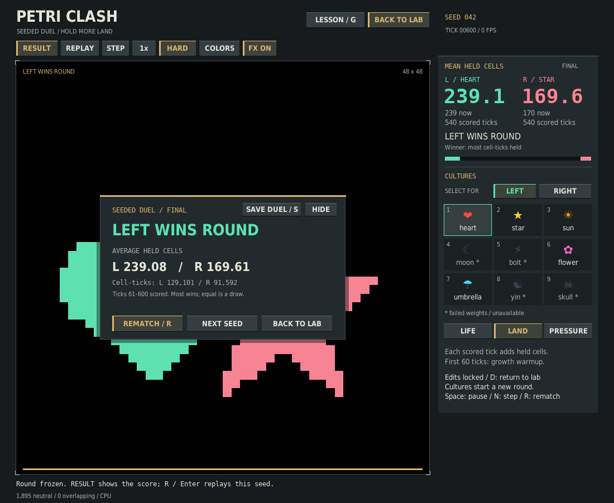

# Portable duel recipes

Verified on 2026-10-04 against the cumulative CPU-inference revision
`b1e29757732360739e7b734477062f286d70ef51`. This adds saving and bounded CPU
reruns around existing duels; simulation math, scoring, weights and `v1/` stay
unchanged.

## Why this workflow

Existing match reports contain enough details to reconstruct a duel manually,
but one custom round required 37 command-line tokens. Exporting launch arguments
would also be wrong after interface changes: the current cultures and mode live
in the Arena, while the initial arguments can still describe the old selection.
Moving to another seed or back to the lab also replaces the completed round
before an exit-time report is written.

The completed result now offers **SAVE DUEL / S**. It saves a separate, portable
recipe immediately and leaves the frozen board, scores and RNG untouched. The
normal diagnostic report keeps its existing format. A separate `replay.py`
command reruns the full CPU round and compares the two saved integer totals.



The saved file is a recipe and expected score, not a video or serialized model.
No file dialog, live-session recorder, network service, model-path import or
training workflow is introduced. For programmatic use, `--export-duel FILE`
writes the final completed round on exit. Interactive saves use unique files in
`./duels/`, or the folder selected with `--duel-save-dir`.

## Versioned, bounded format

The [real shipped-model example](duel-recipe-example.json) records a 600-tick
heart/flower hard duel with simulation seed 7 and 60 warmup ticks. It pins heart
checkpoint seed 0 and flower checkpoint seed 2. Its saved cell-tick totals are
**123,178 left / 121,494 right**.

Version 1 requires exactly these sections:

- `schema`, `schema_version` and `ruleset_version`
- `models`: each side's exact local catalog stem and integer checkpoint seed
- `configuration`: mode, simulation seed, actual grid size, actual starting
  positions, mirrored/custom placement, round/warmup lengths and all five rules
- `runtime`: CPU device/thread count, deterministic setting and software/platform
  diagnostics
- `expected_score`: left and right integer cell-tick totals

The file contains no checkpoint path or fingerprint, weight/state tensors, RNG
states, UI settings, action stream, host identity or elapsed timing. Winners,
averages, scoring windows and metrics are derived instead of being duplicated.

Export and import enforce the same limits: 64 KiB input, grids 8–128, 1–10,000
total ticks, 1–64 CPU threads, 32-bit nonnegative seeds, and legal actual seed
coordinates from 2 through `size - 3`. Mirrored coordinates must match the duel
convention. Scores cannot exceed the board's possible scored cell-ticks; hard
mode also bounds the two sides' sum. Diagnostic strings are bounded and cannot
contain paths or control characters.

Malformed JSON, duplicate fields, unexpected keys, unknown schema/ruleset
versions, bool-as-integer values, nonfinite numbers, invalid rules and impossible
scores are rejected before model allocation. Target names resolve only through
the local catalog. An exact checkpoint that is missing, malformed or no longer
ready is rejected without selecting another seed, enabling unhealthy models or
starting training.

## Saving and file safety

Only finite, valid, completed CPU duels with ready loaded checkpoints can be
exported. The exporter captures actual loaded culture/seed identities, current
mode, resolved size, clamped positions and the round's scoring configuration.
Sandbox, lesson, partial and invalid states do not produce a recipe.

Repeated SAVE clicks or S presses reuse the same saved file for the same finished
round. A rematch or new seed has a new round identity and can save separately;
deleting a saved file allows it to be saved again. A write failure leaves the
round intact and permits retry. S also works with the result panel hidden.

Unique UI files use exclusive creation and clean up on write failure. Explicit
recipe destinations are validated/serialized before an atomic replacement, so
failed writes or replacement preserve previous destination bytes. Replay report
and PNG outputs also use atomic replacement. Lexical, resolved-symlink and
existing-hardlink aliases between an input and output are rejected; output files
must be distinct.

## Interpreting a rerun

The CLI reports **Saved scores matched**, **Saved scores differed**, or an invalid
simulation whose saved scores remain unverified. Its optional report retains
expected and observed integer totals, runtime differences and a structured
status. Exit codes are 0 for a valid match, 1 for a score difference/invalid
simulation, and 2 for input, loading or output errors.

Runtime-version/platform differences warn before stepping, then the score check
still runs. This follows [PyTorch's reproducibility guidance](https://docs.pytorch.org/docs/2.14/notes/randomness.html):
results are not promised across different releases, platforms or CPU/GPU
execution. A matched score alone does not verify bitwise tensor history, model
identity, provenance or competitive balance. Changed weights under the same
culture/seed cannot be reliably detected without fingerprints; the recipe does
not claim to detect them.

## Verification outcome

The complete CPU suite passed **305 tests and 869 subtests** with shipped
checkpoints enabled and no skips. Compilation and whitespace checks passed.
The 56 new tests cover codec bounds, malformed/duplicate fields, exact checkpoint
selection, atomic failures, no-clobber saves, output aliases, callback ordering,
headless operation, state/RNG purity and repeated UI transitions.

Actual-checkpoint checks included:

- The 600-tick example above reran with exactly **123,178 / 121,494** cell-ticks.
- A fresh 80-tick custom 40×40 round launched as heart/star/hard, then selected
  flower/umbrella and soft mode. Export preserved the actual flower seed 2 /
  umbrella seed 0 selection, simulation seed 51, nondefault rules and clamped
  positions `(2,37)` / `(37,2)`, while launch arguments still described the old
  selection. The rerun matched **3,936 / 5,254** cell-ticks, all four final tensor
  byte patterns/layouts and the simulation RNG states in this environment.
- Changing one expected cell-tick produced a different-score result. Changing
  only a runtime-version diagnostic emitted a warning and still matched scores.
  [Portable custom-round check data](duel-recipe-checks.json).
- CI's fresh export/replay smoke generates and checks its recipe in the same
  run, rather than assuming the published example must match across versions.

SAVE, repeat-save, HIDE then S, and NEXT SEED then S also worked on the native
cloud desktop using real checkpoints. Its connection then closed during resize;
native minimum-size resizing, replaying those native-saved files, and closing
that QA game/terminal could not be confirmed. This does not count as a complete
native walkthrough. Default and minimum-size offscreen captures were inspected,
and automated resize/hit-routing, save/retry, frozen-state and headless replay
checks passed. The desktop interruption did not affect the shell test runs.

## Reproduce

From the repository root with CPU dependencies and shipped checkpoints:

```bash
python v2/clash.py --device cpu --duel --left 1 --right 6 --seed 7 \
  --headless-frames 600 --export-duel saved-duel.json
python v2/replay.py saved-duel.json --report replay-check.json \
  --snapshot replay-board.png
PETRI_TEST_CHECKPOINTS=1 python -m pytest v2/tests -q
python -m compileall -q v2
```

The published example can also be rerun directly. It may warn about runtime
differences, which are separate from whether its scores match:

```bash
python v2/replay.py v2/verification/duel-recipe-example.json
```

The default-size screenshot is reproducible with the existing capture helper:

```bash
python v2/verification/capture_duel.py --output duel-recipes.png
```

That image checks raster layout, not native-display latency or FPS.
