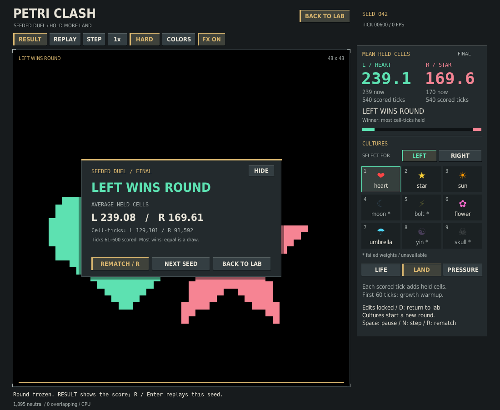

# Seeded duel verification

Verified on 2026-10-04 against the tactical-HUD baseline `6068032f2dca4a0721c12e95c565f6fd055d2914`.



## What changed

- Opt-in, finite rounds alongside the existing editable sandbox. Default rounds have 600 ticks, with ticks 1–60 excluded from scoring and ticks 61–600 scored exactly once.
- Integer cell-tick totals determine the result. The HUD displays averages and current counts; the result includes the exact totals and scoring range. Equal totals draw. Hard mode scores held territory; soft mode scores independent living cells, including overlap.
- Mirrored near-center starts, a visible tick countdown and progress track, pause/step support, and frozen results. Replay repeats the same seed; next seed advances it deterministically. The result can be hidden to inspect the board without losing its score.
- Manual edits are blocked in duels. Returning to the lab restores them. Culture/rule changes start a new round; failed checkpoint loads preserve the ongoing match, including the CPU initialization RNG.
- A non-finite input or raw model proposal invalidates a duel instead of receiving a win/draw. Hard-mode sandbox quarantine remains unchanged. Invalid headless rounds write their diagnostic result and exit nonzero.
- Headless imports no longer load Pygame. The UI still uses the same Pygame renderer when requested.

Neither v1 nor the shipped model weights were changed. The healthy-model simulation math is unchanged. Different learned shapes have different sizes and strengths; these scores describe a round, not a balanced tournament or general model-quality ranking.

## Verification

The checkpoint-enabled full CPU suite passes **143 tests and 166 subtests**. `compileall` and `git diff --check` pass.

Coverage includes exact warmup/end boundaries, draw and integer precision, side-swapped scoring, duplicate/skipped sample rejection, immutable terminal exports, hard/soft speed-1/2/4/8 replay equality, pause and repeated draws, all presentation RNGs, result hiding/reopening, same-seed replay, next-seed wraparound, failed-load RNG preservation, locked edits, custom positions, culture/rule resets, invalid model output, and genuine SDL-free headless execution.

Interrupted/repeated UI checks cover clicks through stale result controls, keyboard rematches, returning to the sandbox, and resizing with fresh hit geometry. Controls were inspected at 1100×902 and 860×740, including warmup, hard results, soft results and the exact-score breakdown. Automated layout coverage also exercises 1800×740 and 860×1200.

The actual shipped heart/star checkpoints replayed identical tensors and scores at different frame speeds. The performance comparison below additionally verifies identical final organism, ownership and control tensors and Torch RNG between scored and unscored runs with identical positions.

## Measured CPU cost

Real heart/star checkpoints, 48×48 grid, one Torch CPU thread. Three alternating-order pairs per mode, 20 warmup ticks excluded from timing, 240 measured ticks per run. Values below are medians of each run's p50. Loading, rendering, FPS pacing and native display/compositor behavior are excluded.

| Mode | Sandbox step p50 | Duel step p50 | Added bookkeeping |
| --- | ---: | ---: | ---: |
| Hard | 7.258 ms | 7.425 ms | 0.167 ms |
| Soft | 5.625 ms | 6.017 ms | 0.392 ms |

Host timings vary; no simulation speedup is claimed. The added work is opt-in scoring and validity checking. See the [raw measurements](duel-performance.json) and [reproducible benchmark](benchmark_duel.py). CPU execution was verified; GPU behavior and native-window display latency were not measured.

## Reproduce

```bash
PETRI_TEST_CHECKPOINTS=1 python -m pytest v2/tests -q
python -m compileall -q v2
python v2/clash.py --device cpu --duel --round-ticks 32 --warmup-ticks 8 \
  --headless-frames 40 --report /tmp/duel.json
python v2/verification/capture_duel.py --output /tmp/duel-result.png
python v2/verification/capture_duel.py --width 860 --height 740 --ticks 0 \
  --output /tmp/duel-warmup.png
python v2/verification/benchmark_duel.py --output /tmp/duel-performance.json
```

Design references: [Subset's clear objective/readable strategy direction](https://www.subsetgames.com/itb.html), [quick-start accessibility guidance](https://gameaccessibilityguidelines.com/allow-the-game-to-be-started-without-the-need-to-navigate-through-multiple-levels-of-menus/), and [fixed simulation steps independent of rendering](https://gafferongames.com/post/fix_your_timestep/).
