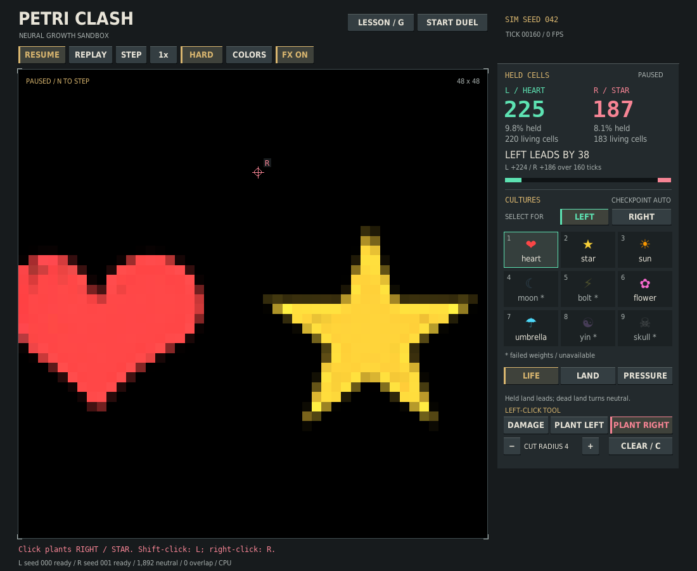
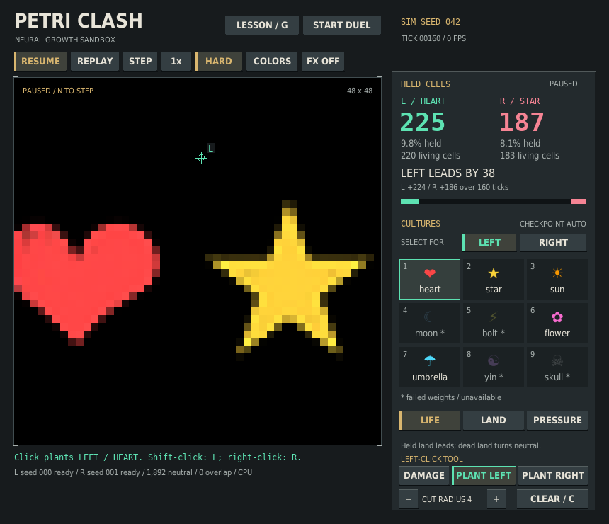

# Mouse-only lab tools

Verified on 2026-10-04 against the cumulative checkpoint-picker revision
`98a2368d193b7066f12a7861fdd1ab5e62a2a9cf`. This changes sandbox controls and
pointer feedback; model weights, NCA math, battle rules, scoring and `v1/` are
unchanged.

## One input method for ordinary lab edits

Previously, placing a left seed required Shift-click and clearing the board
required C, even though most of the interface worked with the mouse. A compact
**LEFT-CLICK TOOL** row now replaces the lower rail's static help text:

- **DAMAGE** preserves the default left-click crater behavior.
- **PLANT LEFT / PLANT RIGHT** select one-seed placement with ordinary left-click.
- **− / +** change the damage radius; planting remains one seed.
- **CLEAR / C** clears the field and visibly explains how to plant again.



The rail stays the same size and the field is not reduced. Tool selection is
separate from the culture picker's side, so choosing PLANT RIGHT cannot silently
change a checkpoint pin or replace a culture. Selection and radius controls leave
tensors, RNG, tick count, loaded models and pause state unchanged.

Shift-left-click and right-click remain temporary left/right planting shortcuts.
They never change the persistent tool. Clear, replay, culture/rule changes,
views, colors, FX and pause retain the chosen tool. Returning to a fresh lab from
a duel or lesson restores DAMAGE. All free editing remains locked in those modes,
including stale lab-button rectangles before the next draw.

The radius is bounded to the current field size. An oversized initial command-line
radius is capped with a visible notice, avoiding a misleading + button that would
otherwise shrink it on its first use. The explicit simulation damage API keeps
its original radius behavior.

## Honest, static pointer feedback

Preview and dispatch share the same effective-tool resolver and grid-cell mapping.
Damage shows a circle at the selected radius; planting shows a small crosshair
and L/R marker at the cell that will receive the seed. The planting letter stays
below the inset field captions near the top edge. All pointer graphics are clipped
to the board, and the previous drawing clip is restored.

The static cue remains with FX OFF. Shift is tracked in event order rather than
polling the current physical keyboard state. That matters for both a complete
Shift-click-release in one frame and a plain click immediately followed by Shift:
a later key state must not rewrite the earlier click. This follows the distinction
in [Pygame's keyboard-event documentation](https://www.pygame.org/docs/ref/key.html)
between event-time modifiers and current physical state.

Focus loss clears both Shift keys. Startup and refocus begin with neutral modifier
state; release and press Shift again if it was already held. This conservative
boundary avoids an accidental planting action from a stale or future modifier.
The visible planting tools and right-click remain available. Unsupported mouse
buttons do not edit the field.



This follows the Game Accessibility Guidelines' advice on
[consistent input methods](https://gameaccessibilityguidelines.com/ensure-that-all-areas-of-the-user-interface-can-be-accessed-using-the-same-input-method-as-the-gameplay/)
and [simpler control alternatives](https://gameaccessibilityguidelines.com/ensure-controls-are-as-simple-as-possible-or-provide-a-simpler-alternative/).
The L/R labels and distinct shapes also follow
[Xbox's guidance on reinforcing color with text and shapes](https://learn.microsoft.com/en-us/xbox/accessibility/xbox-accessibility-guidelines/103).
This is a narrower mouse-only editing improvement, not a claim of full
accessibility conformance, screen-reader support or complete keyboard navigation.
Buttons still activate on mouse-down; release-to-cancel and undo are not provided.

## Verification

The complete CPU suite passed **404 tests and 1,121 subtests**, with shipped
checkpoint tests enabled and no skips. Compilation and whitespace checks passed.
The new lab suite contains 35 tests and 229 subtests covering:

- Mouse planting, damage and clear in hard/soft and live/paused states
- Accurate immediate counts and unchanged explicit edit API semantics
- Pointer/culture-picker independence, differing pins and unchanged RNG/models
- Temporary modifiers, queued/repeated input, focus loss and resize-then-click
- Tool persistence and reset behavior across every relevant lifecycle action
- Hidden/finished/invalid duels and all lesson phases rejecting stale controls
- Radius bounds, oversized startup settings, cell-snapped cues and restored clips
- Complete labels and non-overlapping hitboxes at 860×740 and 1100×902

Independent bundled-weight SDL checks exercised clear → both planting tools →
128 mouse STEP actions → radius-5 damage. In the hard-mode check, left living
cells changed from 241 to 185 (56 removed), while the right stayed at 182. A
separate soft-mode overlap/damage flow passed. The existing full 600-tick
heart/flower recipe still matched its expected **123,178 / 121,494** cell-ticks.

Both displayed screenshots use shipped heart/star weights grown for 160 ticks.
Default, minimum, reduced-motion, damage and corner-marker captures were inspected.
The native desktop connection was unavailable, so current interaction/layout QA
used dummy SDL rather than a native window; real pointer delivery by an operating
system and assistive-technology usability have not been validated in this batch.

## Reproduce

```bash
PETRI_TEST_CHECKPOINTS=1 python -m pytest v2/tests -q
python -m compileall -q v2
python v2/verification/capture_lab_tools.py --tool plant_right
python v2/verification/capture_lab_tools.py --tool plant_left \
  --width 860 --height 740 --reduced-motion --output lab-tools-minimum.png
python v2/replay.py v2/verification/duel-recipe-example.json
```

The capture helper renders a deterministic pointer location offscreen; it does
not claim to move a native cursor. Benchmark and simulation CLI behavior remain
unchanged.
